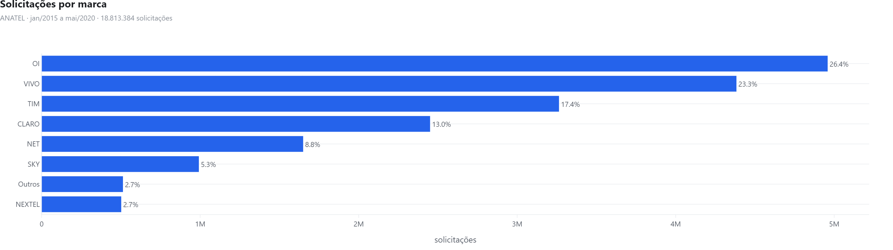
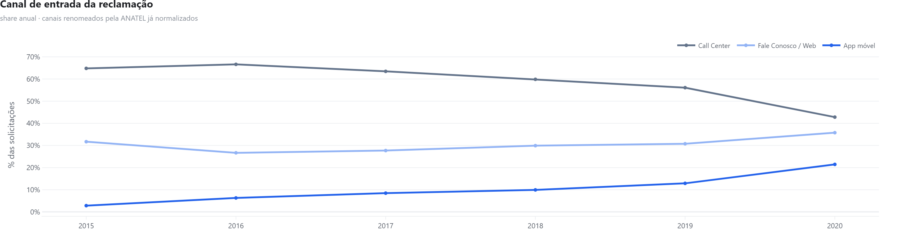
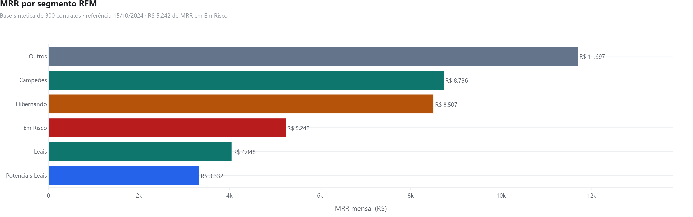

# Telecom EDA — reclamações regulatórias e segmentação de base

<div align="center">


-0F5F52?style=for-the-badge)


**Duas análises sobre o mesmo setor, de dois ângulos: o que o consumidor reclama
do mercado, e o que a base de uma operadora diz sobre quem está prestes a sair.**

</div>

> Peça do portfólio de **Hugo Nazário**, Analista de Dados — cada projeto, com o contexto de por que foi feito, está em **[hugonazario.com](https://hugonazario.com/)**.



---

## O que tem aqui

| Análise | Pergunta | Entrada | Saída |
|---|---|---|---|
| **EDA ANATEL** (`run_eda.py`) | O que gera reclamação no setor, e o padrão é de mercado ou de uma marca? | Base **aberta e real** da ANATEL: 15.952.407 linhas, 18.813.384 solicitações, jan/2015 a mai/2020 | 5 gráficos + relatório de qualidade do dado + 4 hipóteses testadas e 1 declarada não-testável |
| **RFM** (`run_rfm.py`) | Quem, na base, está a caminho do cancelamento? | 300 contratos · 4.398 boletos | Segmentos com MRR, e o buraco que as regras deixam |

A EDA roda sobre agregados versionados (136 KB) extraídos da fonte real por
`tools/preparar_anatel.py`; o RFM roda sobre base sintética versionada. Nenhuma
depende de credencial ou de arquivo que não esteja no repositório.

---

## EDA ANATEL — limpeza e teste de hipótese

O ponto do exercício não é o gráfico: é a **sujeira** — e desde 01/09/2026 ela
deixou de ser fabricada. O projeto rodava sobre CSV sintético que imitava os
defeitos do arquivo da ANATEL. Agora roda sobre **a base real**, e as armadilhas
são as de verdade, que são melhores:

| Armadilha da fonte real | O que ela faz com quem não olha | Tratamento |
|---|---|---|
| **A ANATEL renomeou canais no meio da série** — "Fale Conosco" virou "Usuário WEB", "Aplicativo Móvel" virou "Mobile App" | A série afirma que reclamação por app **caiu a zero** em 2020, quando é o canal que mais cresce | mapa `CANAL_RENOMEADO`, aplicado antes de qualquer leitura temporal |
| **2020 tem cinco meses** (jan–mai) | Comparar 2020 com ano cheio é comparar 5 meses com 12 | recorte de meses iguais nos dois lados |
| **O grão não é a reclamação** — cada linha já é uma contagem em `SOLICITAÇÕES` | Contar linhas subestima: 15.952.407 linhas para 18.813.384 solicitações | soma de `SOLICITAÇÕES`, nunca `len()` |
| **"Denúncia Anônima" e "Denúncia ANÔNIMA"** convivem | Mesma categoria contada duas vezes | documentado no relatório de qualidade |
| **2,5 GB de CSV** | Não cabe em memória nem em repositório git | leitura em blocos de 1,5 M, agregados de 136 KB versionados |

O relatório completo sai em
[`outputs/data_quality_report.md`](outputs/data_quality_report.md) — gerado pelo
script, não escrito à mão.

### O que se perdeu na migração

A base real **não tem status de atendimento**. A "taxa de resolução" que a versão
sintética publicava — e que era a manchete dos KPIs — simplesmente não existe
aqui, e não há como reconstruir.

No lugar dela entrou a **taxa de reabertura** (`Condição = Reaberta`): a proporção
de casos que o consumidor teve de reabrir. Mede coisa parecida, e o dado sustenta.

Trocar uma métrica boa porém inventada por uma pior porém real é o ponto do
projeto — e vale registrar que a migração **custou** alguma coisa, em vez de
fingir que só houve ganho.

### As cinco hipóteses

Declaradas **antes** de olhar o resultado, e o script imprime o veredito. Uma
hipótese que só pode dar certo não é hipótese. **Três das cinco foram refutadas** —
o dado real discordou da intuição em quase tudo.

| # | Hipótese | Resultado |
|---|---|---|
| H1 | A CLARO é a marca mais reclamada | **Refutada** — lidera a **OI**, com 26,36%; a CLARO é a **4ª**, com 13,03% |
| H2 | O canal de reclamação continua sendo o telefone | **Refutada** — Call Center caiu de 64,8% para 42,8%; o app subiu de 2,8% para 21,4% |
| H3 | O que gera reclamação é falha técnica | **Refutada** — **Cobrança** é 33,62%; qualidade e reparo, 14,29% |
| H4 | Quem recebe mais reclamação também reabre mais | **Não sustentada** — Spearman +0,05; a pior taxa é da NEXTEL (15,27%), que não é a de maior volume |
| H5 | A queda das reclamações indica serviço melhor | **Não testável** — ver abaixo |

**H1 é a mais desconfortável, e por isso a mais útil.** A versão sintética deste
mesmo projeto afirmava que a CLARO liderava. O gerador supunha que o líder de
mercado seria o líder de reclamação — parecia razoável e estava errado. É a
demonstração mais limpa de por que dado sintético não substitui dado observado:
ele confirma a suposição de quem o escreveu.

**H5 não recebe veredito, e isso é de propósito.** A base traz reclamação
registrada, não satisfação nem base de assinantes. Queda de volume pode ser
serviço melhor, canal mais difícil ou consumidor que desistiu de reclamar. Sem
denominador, a pergunta não se responde — e responder assim mesmo seria opinião
com cara de métrica. Para respondê-la faltaria a base de assinantes por marca,
que é exatamente a coluna que o
[telecom-powerbi-public](https://github.com/HugoLeonardoNz/telecom-powerbi-public)
traz, e lá ela inverte o ranking.



---

## RFM — quem está saindo antes de cancelar

Churn em ISP não acontece de uma vez. Existe um padrão de comportamento antes do
cancelamento formal: o cliente começa a atrasar boleto, depois para de pagar, e
só então liga para cancelar. **Recência**, **Frequência** e **Valor** dos
pagamentos capturam esse padrão enquanto ainda dá para agir.

| Métrica | Definição | Leitura |
|---|---|---|
| Recência (R) | Dias desde o último boleto pago | R baixo = pagou recentemente |
| Frequência (F) | Quantidade de boletos pagos | F alto = cliente de longa data |
| Monetário (M) | Soma total paga | M alto = alto valor acumulado |

Cada métrica é cortada em quintis (1–5) e o score é a concatenação dos três —
"545" é recente, frequente e de alto valor.

| Segmento | Contratos | % base | MRR (R$) | % MRR |
|---|---:|---:|---:|---:|
| **Outros** (sem regra) | **63** | **21,9%** | **11.697** | **28,1%** |
| Campeões | 54 | 18,8% | 8.736 | 21,0% |
| Hibernando | 73 | 25,3% | 8.507 | 20,5% |
| **Em Risco** | **38** | **13,2%** | **5.242** | **12,6%** |
| Leais | 32 | 11,1% | 4.048 | 9,7% |
| Potenciais Leais | 28 | 9,7% | 3.332 | 8,0% |



**O maior bloco de receita é o que a segmentação não classifica.** As regras de
`src/rfm.py` cobrem combinações específicas de R, F e M; 63 contratos — 21,9% da
base e 28,1% do MRR — não caem em nenhuma delas e vão para o balde "Outros". E
"Perdidos", que existe nas regras, sai **vazio**.

Isso não é um erro de execução, é o resultado honesto: um conjunto de regras
escrito à mão sobre quintis deixa buraco, e o buraco aqui é maior que qualquer
segmento nomeado. Quem usasse esta segmentação para priorizar retenção estaria
ignorando o maior pedaço da carteira. O caminho para fechar isso é regra derivada
dos dados em vez de faixa arbitrária — e essa é a fronteira entre este exercício
e o `churn-predictor`, que modela em vez de segmentar.

Dos 300 contratos, **288 entram no RFM**: 12 nunca tiveram boleto pago, e cliente
sem pagamento não tem recência, frequência nem valor para medir.

> **Em Risco + Hibernando** somam 111 contratos e **R$ 13.749 de MRR** — um terço
> da receita mensal com sinal de saída. É o número que justifica a ação.

---

## Como rodar

```bash
pip install -r requirements.txt

python run_eda.py          # EDA ANATEL: lê os agregados, testa H1–H5, exporta figuras
python run_rfm.py          # RFM: gera a base sintética, segmenta e exporta a figura

# o mesmo RFM, passo a passo e com a variante que lê de banco:
jupyter notebook notebooks/rfm_analysis.ipynb

# opcional — refaz os agregados a partir da fonte (baixa ~334 MB, gera 2,5 GB)
python tools/preparar_anatel.py
```

`run_eda.py` roda em segundos porque lê os agregados versionados. Quem quiser
refazer tudo do zero roda `tools/preparar_anatel.py`: ele baixa o arquivo da
ANATEL, faz **uma** passada em blocos de 1,5 milhão de linhas e reemite os sete
agregados — conferindo, ao final, que todos fecham no mesmo total.

`run_eda.py` grava os HTMLs interativos em `outputs/figures/` e os PNGs deste
README em `docs/img/`. O tema dos gráficos fica em
[`src/theme.py`](src/theme.py): título, subtítulo, tipografia, grade e escala de
cor são definidos uma vez e aplicados por `finish()` — gráfico novo sai com o
mesmo acabamento dos outros sem ninguém lembrar de nada.

O notebook de RFM roda em dois modos: **PostgreSQL**, apontando para o schema do
[`sql-analytics-pack`](https://github.com/HugoLeonardoNz/sql-analytics-pack), ou
**standalone**, com os dados sintéticos que já vêm no repositório.

---

## Estrutura

```
telecom-eda-public/
├── run_eda.py                    — EDA ANATEL de ponta a ponta
├── src/
│   ├── theme.py                  — tema único dos gráficos (finish, save)
│   └── rfm.py                    — calculate_rfm(), score_rfm(), assign_segments()
├── notebooks/
│   └── rfm_analysis.ipynb        — segmentação da base (RFM, dado sintético)
├── tools/preparar_anatel.py      — baixa a fonte real e emite os agregados
├── data/
│   ├── processed/                — 7 agregados versionados (136 KB)
│   └── raw/                      — CSV de 2,5 GB (ignorado pelo git)
├── outputs/
│   ├── figures/                  — 5 HTMLs interativos
│   └── data_quality_report.md    — auditoria de qualidade, gerada
└── docs/img/                     — PNGs do README, exportados pelo script
```

---

## Fonte dos dados

**EDA ANATEL:** base **aberta e real** da ANATEL — painel de dados do consumidor.
15.952.407 linhas, **18.813.384 solicitações**, jan/2015 a mai/2020, 28 UFs, 83
assuntos. Dado observado, publicado pelo regulador; os números podem ser citados
como fato de mercado, dentro do período coberto.

Fonte: `https://www.anatel.gov.br/dadosabertos/paineis_de_dados/consumidor/`

O CSV bruto tem 2,5 GB e **não** está no repositório. O que está versionado são os
sete agregados em `data/processed/` (136 KB), reproduzíveis por
`tools/preparar_anatel.py`.

> **Há dois projetos "ANATEL" neste portfólio, e eles não compartilham base.** Este
> aqui usa o **dado real** do regulador, com grão mensal já agregado; o
> [telecom-powerbi-public](https://github.com/HugoLeonardoNz/telecom-powerbi-public)
> usa **8.000 registros sintéticos** com star schema, denominador de assinantes e
> taxa de resolução — métrica que a base real não tem. Propósitos diferentes:
> um mostra análise sobre dado observado em escala, o outro mostra modelagem
> dimensional. Um não confere o outro, e nenhum dos dois finge ser o outro.

**RFM:** base FiberNet ISP (sintética) — 300 contratos · 5 cidades da RMBH ·
4 planos de fibra · jan/2022 a out/2024. Mesma **escala e recorte** do
[`sql-analytics-pack`](https://github.com/HugoLeonardoNz/sql-analytics-pack), mas
não a mesma tabela: cada projeto gera a sua. O
[`churn-predictor`](https://github.com/HugoLeonardoNz/churn-predictor) trabalha em
outra escala (15.000 contratos, 5 regiões).

---

*Hugo Nazário · Analista de Dados Pleno — Speed Fibra*

---

## Os achados publicados são testados

```bash
pip install -r requirements-dev.txt
pytest tests/ -v
```

Número em README não executa — e foi exatamente por isso que este portfólio deixou
texto e código divergirem em silêncio mais de uma vez. Num dos repositórios, um
comentário explicava que 87,0% era número inventado e o gráfico sessenta linhas
abaixo plotava 87,0%. Em outro, o texto dizia "São Paulo tem a melhor taxa do país"
enquanto o CSV ao lado registrava que era o 5º.

Cada número do README vira asserção sobre os mesmos agregados que o `run_eda.py`
publica: OI em 26,36%, CLARO em 4º, Cobrança em 33,62%, app de 2,8% para 21,4%.
**H5 tem o teste invertido** — ele falha se ela GANHAR veredito, porque confirmá-la
exigiria base de assinantes, que a fonte não tem.

Três testes cuidam das armadilhas da fonte, não dos achados: se alguém remover a
normalização dos canais renomeados, o teste que verifica `App móvel = 21,4% em
2020` quebra — e quebra **antes** de a conclusão invertida ser publicada. Outro
confere que os sete agregados fecham no mesmo total; divergir significa erro de
agregação, não de texto.

Se o gerador, a fonte ou a limpeza mudarem, o teste falha e obriga a atualizar o
texto. É a mesma regra que vale para dado: **ou se deriva de uma fonte só, ou se
escreve um teste que falha quando as duas divergirem.**
