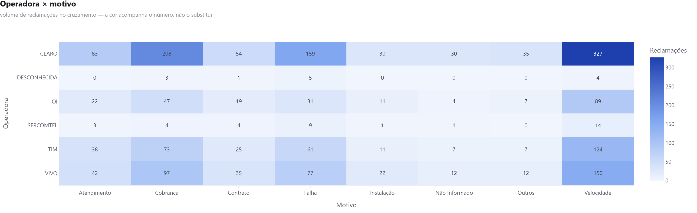
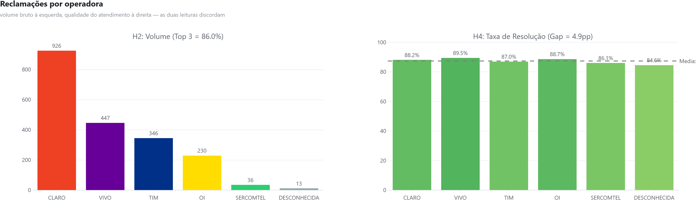

# Telecom EDA — reclamações regulatórias e segmentação de base

<div align="center">


**Duas análises sobre o mesmo setor, de dois ângulos: o que o consumidor reclama
do mercado, e o que a base de uma operadora diz sobre quem está prestes a sair.**

</div>



---

## O que tem aqui

| Análise | Pergunta | Entrada | Saída |
|---|---|---|---|
| **EDA ANATEL** (`run_eda.py`) | O que gera reclamação no setor, e o padrão é de mercado ou de uma marca? | CSV bruto no formato real da ANATEL — latin-1, `;`, duplicatas, nulos implícitos | 7 gráficos + relatório de qualidade do dado + 5 hipóteses testadas |
| **RFM** (`notebooks/rfm_analysis.ipynb`) | Quem, na base, está a caminho do cancelamento? | 300 contratos · ~4.2 mil boletos | 6 segmentos com ação recomendada e MRR em risco |

As duas rodam sozinhas, com dados sintéticos versionados. Nenhuma depende de
credencial, banco ou arquivo que não esteja no repositório.

---

## EDA ANATEL — limpeza e teste de hipótese

O ponto do exercício não é o gráfico: é a **sujeira**. O CSV é gerado com os
mesmos defeitos do arquivo real do portal da ANATEL, e o pipeline tem de
sobreviver a todos eles.

| Problema | Por que quebra | Tratamento |
|---|---|---|
| Encoding latin-1 | Todo acento vira caractere corrompido se lido como UTF-8 | `encoding='latin-1'` |
| Separador `;` | Com `sep=','` o arquivo vira uma coluna só | `sep=';'` |
| 2,1% de duplicatas | Infla contagem de volume | `drop_duplicates()` |
| Data em texto `DD/MM/AAAA` | Bloqueia qualquer operação temporal | `to_datetime(format=..., errors='coerce')` |
| Capitalização mista | "CLARO", "Claro" e "claro " viram três empresas | normalização para marca canônica |
| Nulos implícitos (`-`, `N/A`, `' '`) | `isna()` devolve zero e o dado inválido passa | `replace(IMPLICIT_NULLS, pd.NA)` |

O relatório completo, coluna a coluna, sai em
[`outputs/data_quality_report.md`](outputs/data_quality_report.md) — gerado pelo
script, não escrito à mão.

### As cinco hipóteses

Declaradas **antes** de olhar o resultado, e o script imprime confirmada ou
refutada. Uma hipótese que só pode dar certo não é hipótese.

| # | Hipótese | Resultado |
|---|---|---|
| H1 | Velocidade é o motivo #1 de reclamação | **Confirmada** — 35,4% do total |
| H2 | As 3 maiores operadoras concentram mais de 70% do volume | **Confirmada** — 86,0% |
| H3 | Há sazonalidade, com pico no primeiro trimestre | **Confirmada** — pico em T1 |
| H4 | A taxa de resolução varia mais de 20pp entre operadoras | **Refutada** — o gap é de 4,9pp |
| H5 | O volume por estado acompanha a população | Ver `top15_estados.html` |

H4 é a mais útil das cinco justamente por ter sido refutada: a intuição de que
"operadora grande atende pior" não se sustenta no dado — todas resolvem em
patamar parecido, e o que as separa é volume, não qualidade de resposta.



---

## RFM — quem está saindo antes de cancelar

Churn em ISP não acontece de uma vez. Existe um padrão de comportamento antes do
cancelamento formal: o cliente começa a atrasar boleto, depois para de pagar, e
só então liga para cancelar. **Recência**, **Frequência** e **Valor** dos
pagamentos capturam esse padrão enquanto ainda dá para agir.

| Métrica | Definição | Leitura |
|---|---|---|
| Recência (R) | Dias desde o último boleto pago | R baixo = pagou recentemente |
| Frequência (F) | Quantidade de boletos pagos | F alto = cliente de longa data |
| Monetário (M) | Soma total paga | M alto = alto valor acumulado |

Cada métrica é cortada em quintis (1–5) e o score é a concatenação dos três —
"545" é recente, frequente e de alto valor.

| Segmento | Clientes | % base | MRR (R$) | % MRR |
|---|---:|---:|---:|---:|
| Campeões | ~44 | 14,7% | ~5.600 | 19,6% |
| Leais | ~61 | 20,3% | ~7.700 | 27,1% |
| Potenciais leais | ~30 | 10,0% | ~3.000 | 10,5% |
| **Em risco** | **~45** | **15,0%** | **~5.400** | **19,0%** |
| Hibernando | ~75 | 25,0% | ~4.200 | 14,9% |
| Perdidos | ~45 | 15,0% | ~2.600 | 9,1% |

> Campeões + Leais são 35% dos clientes e 47% do MRR. Em risco + Hibernando são
> 40% dos clientes e ~R$ 9,6 mil de MRR ameaçado — 33,9% do total.

---

## Como rodar

```bash
pip install -r requirements.txt

python run_eda.py          # EDA ANATEL: gera dados, limpa, testa H1–H5, exporta figuras
jupyter notebook notebooks/rfm_analysis.ipynb
```

`run_eda.py` grava os HTMLs interativos em `outputs/figures/` e os PNGs deste
README em `docs/img/`. O tema dos gráficos fica em
[`src/theme.py`](src/theme.py): título, subtítulo, tipografia, grade e escala de
cor são definidos uma vez e aplicados por `finish()` — gráfico novo sai com o
mesmo acabamento dos outros sem ninguém lembrar de nada.

O notebook de RFM roda em dois modos: **PostgreSQL**, apontando para o schema do
[`sql-analytics-pack`](https://github.com/HugoLeonardoNz/sql-analytics-pack), ou
**standalone**, com os dados sintéticos que já vêm no repositório.

---

## Estrutura

```
telecom-eda-public/
├── run_eda.py                    — EDA ANATEL de ponta a ponta
├── src/
│   ├── theme.py                  — tema único dos gráficos (finish, save)
│   └── rfm.py                    — calculate_rfm(), score_rfm(), assign_segments()
├── notebooks/
│   ├── anatel_eda.ipynb          — a mesma análise, com narrativa
│   └── rfm_analysis.ipynb        — segmentação da base
├── data/                         — CSV sintético gerado pelo script
├── outputs/
│   ├── figures/                  — 7 HTMLs interativos
│   └── data_quality_report.md    — auditoria de qualidade, gerada
└── docs/img/                     — PNGs do README, exportados pelo script
```

---

## Fonte dos dados

**EDA ANATEL:** CSV sintético que reproduz o formato e os defeitos do arquivo
público de reclamações de consumidores (serviço SCM). Serve para demonstrar
limpeza e análise — os números não devem ser citados como fato de mercado.

**RFM:** base FiberNet ISP (sintética), o mesmo universo de
[`sql-analytics-pack`](https://github.com/HugoLeonardoNz/sql-analytics-pack) e
[`churn-predictor`](https://github.com/HugoLeonardoNz/churn-predictor) —
300 contratos · 5 cidades da RMBH · 4 planos de fibra · jan/2022 a out/2024.

---

*Hugo Leonardo · Analista de Dados Pleno — Speed Fibra*
