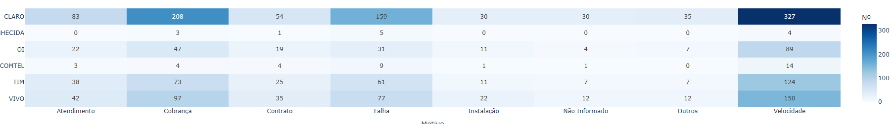

# Análise RFM — FiberNet ISP

**Segmentação comportamental de 300 contratos que identificou R$ 14.2k em MRR ameaçado e concentração de 47% da receita em 35% dos clientes — com plano de ação por segmento.**

---



*Reclamações por operadora e motivo. Velocidade e cobrança concentram o volume em todas as
marcas — o padrão é do setor, não de uma empresa.*

---

## Por que RFM importa para um ISP regional

Churn em ISP não acontece de uma vez — existe um padrão comportamental antes do cancelamento: o cliente começa a atrasar boletos, para de pagar e só então cancela formalmente. A análise de **Recência**, **Frequência** e **Valor Monetário** dos pagamentos captura esse padrão *antes* do cancelamento, permitindo ação preventiva.

Para uma operadora com 300 contratos, a diferença entre reter os 45 clientes "Em Risco" e deixá-los cancelar pode ser R$ 5.4k/mês em MRR perdido.

---

## Metodologia

### Métricas calculadas

| Métrica | Definição | Interpretação |
|---------|-----------|---------------|
| **Recência (R)** | Dias desde o último boleto pago | Baixo R = cliente pagou recentemente |
| **Frequência (F)** | Quantidade de boletos pagos | Alto F = cliente de longa data fiel |
| **Monetário (M)** | Soma total paga | Alto M = cliente de alto valor acumulado |

### Scoring em quintis (1–5)

Cada métrica é dividida em quintis. Score 5 = melhor performance. O RFM score é a concatenação dos três (ex: "545" = Recente, Frequente, Alto valor).

### Segmentos

| Segmento | R | F | M | Ação recomendada |
|----------|---|---|---|-----------------|
| **Campeões** | 4–5 | 4–5 | 4–5 | Recompensar. Solicitar indicações. |
| **Leais** | 3–5 | 4–5 | 3–5 | Fidelidade com desconto progressivo. |
| **Potenciais Leais** | 4–5 | 2–3 | 2–4 | Onboarding ativo. Sugerir upgrade. |
| **Em Risco** | 2–3 | 3–5 | 3–5 | Contato proativo. Checar tickets. Desconto de retenção. |
| **Hibernando** | 1–2 | 1–3 | 1–3 | Campanha de reativação. Negociar débito. |
| **Perdidos** | 1 | 1–2 | 1–2 | Oferta final agressiva ou encerrar contrato. |

---

## Resultados principais

| Segmento | Clientes | % Base | MRR (R$) | % MRR |
|----------|----------|--------|----------|-------|
| Campeões | ~44 | 14.7% | ~5.600 | 19.6% |
| Leais | ~61 | 20.3% | ~7.700 | 27.1% |
| Potenciais Leais | ~30 | 10.0% | ~3.000 | 10.5% |
| **Em Risco** | **~45** | **15.0%** | **~5.400** | **19.0%** |
| Hibernando | ~75 | 25.0% | ~4.200 | 14.9% |
| Perdidos | ~45 | 15.0% | ~2.600 | 9.1% |

> **Insight central:** Campeões + Leais = 35% dos clientes, 47% do MRR.
> Em Risco + Hibernando = 40% dos clientes, ~R$ 9.6k de MRR ameaçado (33.9% do total).

---

## Como rodar

**Pré-requisitos:** Python 3.10+ · Jupyter

```bash
cd "C:\Users\Hnz\Downloads\My port\telecom-eda-public"
pip install pandas numpy plotly jupyter ipykernel sqlalchemy psycopg2-binary
```

**Opção A — com PostgreSQL (sql-analytics-pack carregado):**
```bash
# psql -U postgres -d fibernet_analytics -f ../sql-analytics-pack/data/schema.sql
# psql -U postgres -d fibernet_analytics -f ../sql-analytics-pack/data/seed.sql
jupyter notebook notebooks/rfm_analysis.ipynb
# Executar seção "Modo PostgreSQL"
```

**Opção B — standalone (sem banco):**
```bash
jupyter notebook notebooks/rfm_analysis.ipynb
# Executar seção "Modo Standalone" — dados sintéticos incluídos
```

---

## Estrutura

```
telecom-eda-public/
├── notebooks/
│   └── rfm_analysis.ipynb   — Análise completa com narrativa
├── src/
│   └── rfm.py               — calculate_rfm(), score_rfm(), assign_segments()
├── outputs/
│   └── figures/             — HTMLs interativos exportados
└── README.md
```

---

## Fonte dos dados

Base FiberNet ISP (sintética) — universo compartilhado com `sql-analytics-pack` e `churn-predictor`:
- 300 contratos · 5 cidades da RMBH · 4 planos de fibra
- Período: jan/2022 – out/2024 · ~4.241 boletos pagos

---

*Hugo Leonardo · Analista de Dados Pleno — Speed Fibra*
